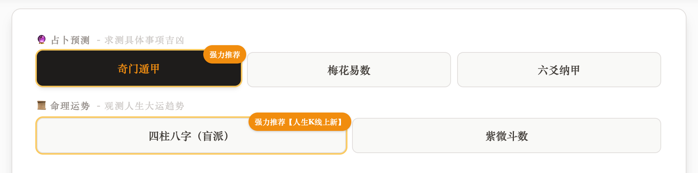
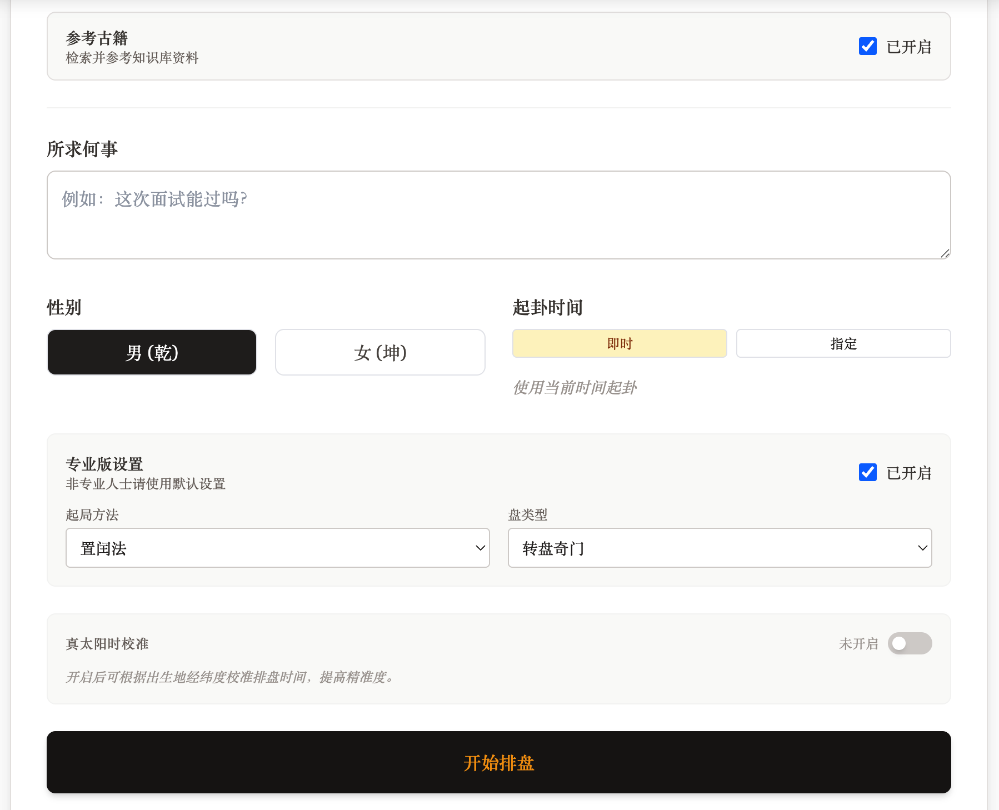
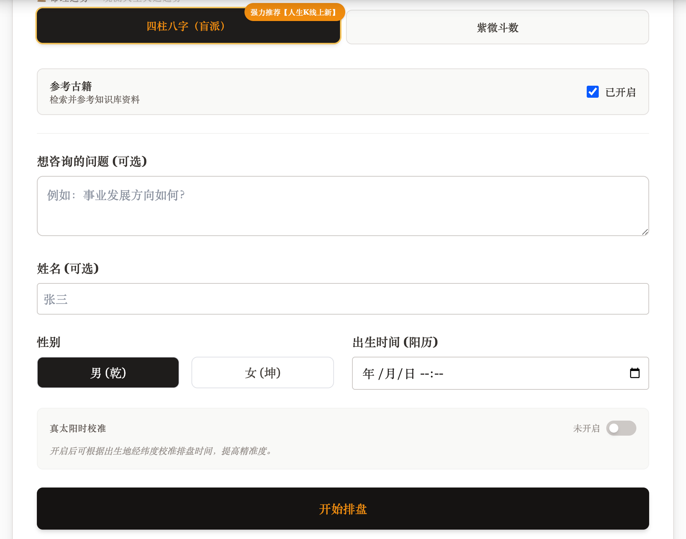
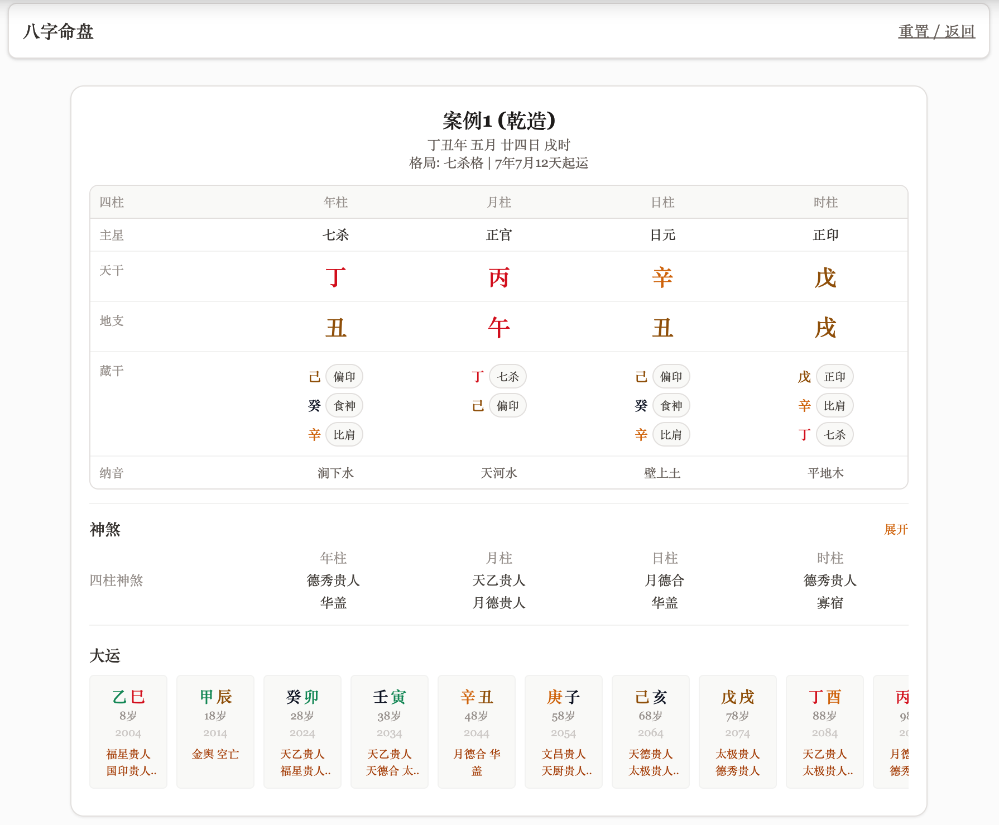
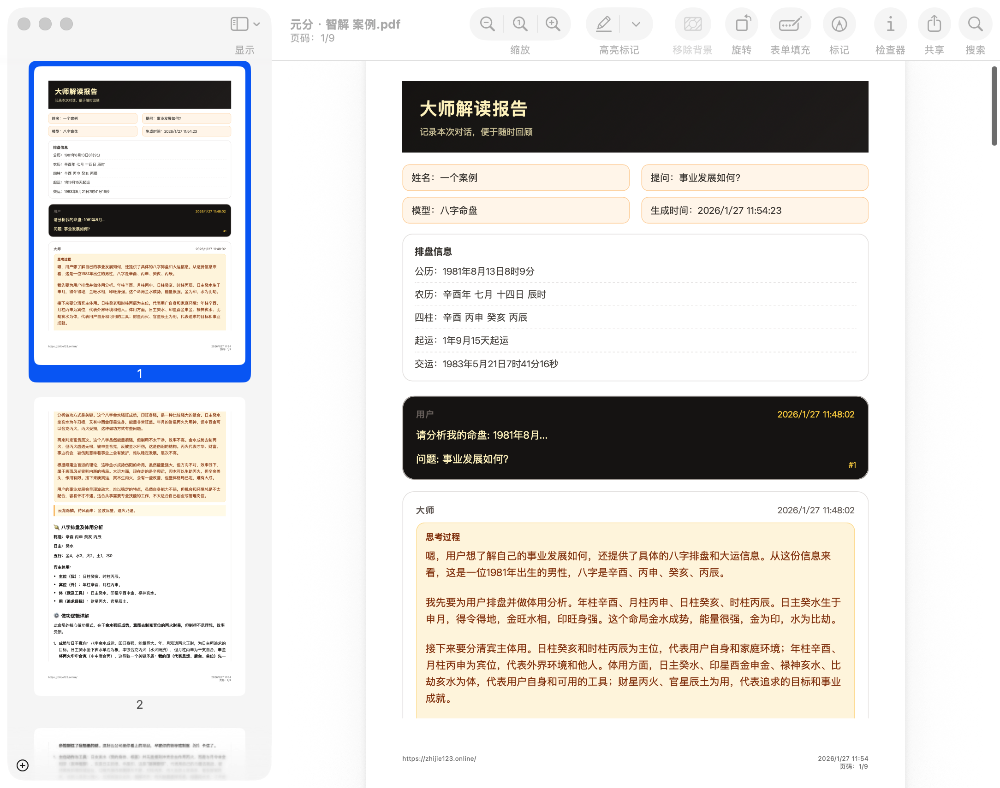
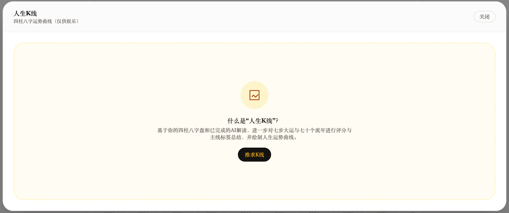
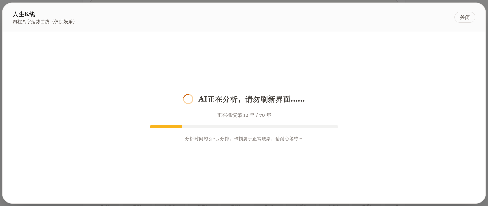

# 项目简介

这是一个占卜与命理一体化的专业分析应用，聚焦奇门遁甲与四柱八字两大核心板块，并通过专业排盘与定制提示词，为大语言模型提供高质量、可溯源的推断支撑。

## 项目特色

1. 覆盖占卜与命理两大板块，其中占卜主推奇门遁甲，命理主推四柱八字。
2. 调用专业排盘 API「缘份居」，提供专业起卦与排盘能力。
3. 针对不同板块进行专业提示词构建，提升模型推断准确度与一致性。
4. 奇门遁甲与四柱八字构建专业知识库，让大语言模型能够参考真实案例。
5. 支持导出专业命理报告。
6. 四柱八字支持人生 K 线分析。

## 功能配图

### 奇门遁甲（占卜）

### 四柱八字（命理）

### 专业排盘结果

### 专业命理报告导出

### 人生 K 线分析

## Demo

`https://zhijie123.online/`

## 本地部署

1. Install dependencies:
   `npm install`
2. Set environment variables in `.env.local`:
   - `DEEPSEEK_API_KEY=your_deepseek_api_key`
   - `YUANFENJU_API_KEY=your_yuanfenju_api_key`
3. Run the app:
   `npm run dev`
